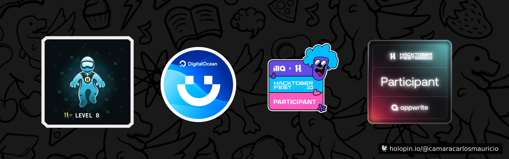

# Portafolio-OS
Repositorio de evidencias para la materia de Sistemas Operativos 27AV

Tarea #998

Tarea #997

Tarea #996

[Video del menú Asciinema](https://asciinema.org/a/elB1nTxv4ikLgI6H8Ai36PCwW)

Tarea #995

Tarea #994

[Menu de los 18 bash scripts](https://github.com/CamaraCarlosMauricio/Portafolio-OS/tree/15023cf89a8387198bf29e22ed06fe21d8a9d8ef/menu)

Tareea #993

[Los 34 comandos de bandit](https://github.com/CamaraCarlosMauricio/Portafolio-OS/blob/15023cf89a8387198bf29e22ed06fe21d8a9d8ef/comandosbandit1-34.txt)

Tarea #992

Tarea #991

Tarea #990

[Crear un jail con Python](https://github.com/CamaraCarlosMauricio/Portafolio-OS/blob/15023cf89a8387198bf29e22ed06fe21d8a9d8ef/jail.py)

Tarea #989

Tarea #988

[Practicas en el laboratorio1](https://github.com/CamaraCarlosMauricio/Portafolio-OS/blob/6f2e84c5c519278294191b9a471865aafc7922f8/Carlos_Camara_Tarea988.pdf)

Tarea #987

[Practicas en el laboratorio2](Carlos_Camara_Tarea987.pdf)

Tarea #986

[Instalacion de servicios Linux](InstalacionDeServiciosLinux)

